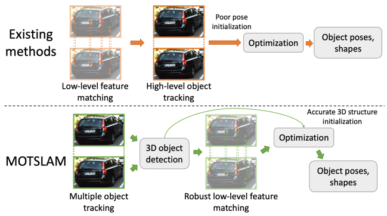

# HANWEI ZHANG (张 涵玮)

Hi there! I am currently a Ph.D student in [CV/CG Lab](https://www.cvg.ait.kyushu-u.ac.jp/index.html), ISEE, Kyushu University.
My undergraduate school is [School of Data and Computer Science](https://cse.sysu.edu.cn/), Sun Yat-sen University.

I am interested in visual computing in 3D.

# Publications

|||
| :-: | :-- |
| 

 |**MOTSLAM: MOT-assisted monocular dynamic SLAM using single-view depth estimation** **Hanwei Zhang**, Hideaki Uchiyama, Shintaro Ono, Hiroshi Kawasaki IROS2022 [arxiv](https://arxiv.org/abs/2210.02038) We present MOTSLAM, a dynamic visual SLAM system with the monocular configuration that tracks both poses and bounding boxes of dynamic objects. MOTSLAM first performs multiple object tracking (MOT) with associated both 2D and 3D bounding box detection to create initial 3D objects.|
